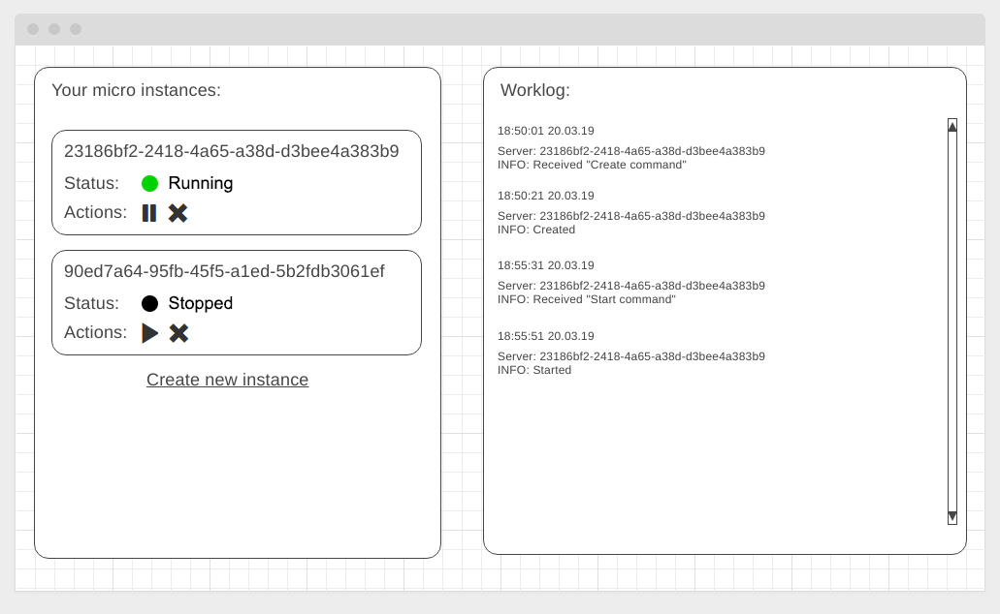

[](https://ci.appveyor.com/project/AlexWEBArt/ahj-cloud-dashboard-frontend)
https://alexwebart.github.io/AHJ-Cloud-Dashboard-fronend/

## Cloud Dashboard

Приложение на "ванильном" JS, иммитирующая реализацию интерфейса для системы управления облачными серверами, позволяющая создавать, запускать, останавливать и удалять облачные сервера, а так же логирующий все процессы.

### Описание

Общий вид рабочего места:



```

#### Серверная часть

SSE, WebSocet

* Создания инстанса (id генерируется автоматически)
* Удаление инстанса по ID
* Изменение состояния (с `running` на `stopped` и со `stopped` на `running`)


router.post('/instances', async (ctx) => {

  setTimeout(() => { // <- для иммитации нагрузки на сервер, ответы отправляются через 20 секунд
    instances.push({
      id,
      state: 'stopped',
    });

  }, 20000);

  ctx.response.body = {
    status: 'ok'
  }
});

#### Клиентская часть

1. Список инстансов (слева)
1. Выполняется подключение по нужному протоколу с началом отслеживания событий. "Ключи":
* `received` - сервером получена команда
* `created` - создан новый инстанс
* `started` - инстанс запущен
* `stopped` - инстанс остановлен
* `removed` - инстанс удалён

Виджет управления инстансами (слева) работает следующим образом:
1. Status - отображает текущий статус
1. Actions - кнопки управления состояниями (зависят от текущего статуса) позволяют отправить команду на запуск, остановку или удаление инстанса
1. Create new instance - позволяет отправить команду на создание нового инстанса.

Все запросы синхронизированы с текущим состоянием на сервере

---
